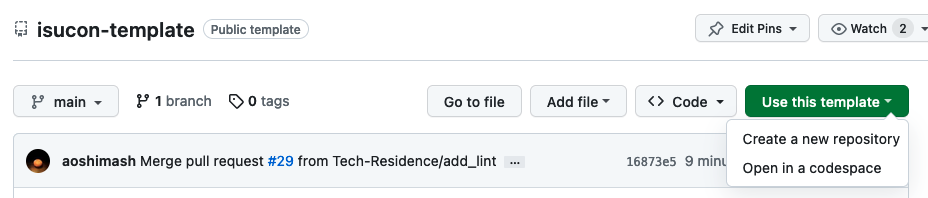

# Setup Guide

このテンプレートリポジトリをcloneして各大会用に使えるようにするまでのセットアップ方法。

#### 大会用リポジトリの用意

このリポジトリをテンプレートとして各大会専用のリポジトリを作成する。

> [!WARNING]
>　ISUCONの大会本番では必ずprivateリポジトリにすること。競技中に問題を外部公開してしまうと失格になる。



#### サーバー接続用の秘密鍵の設定

プロジェクト直下に`.env`ファイルを作成して、サーバーに接続するための秘密鍵を`PRIVATE_KEY`変数の値として記載する。

> [!NOTE]
> - `$HOME/.ssh`以下にあるファイルしか使えない
> - フルパスではなくファイル名のみ記載する
> - ISUCON本番は参加登録時に申請した鍵

e.g.)
```
PRIVATE_KEY="id_ed25519"
```

#### コンテナビルド

ansibleの実行もGoコードのビルドも基本的にはすべてコンテナ上で行う。そのコンテナをビルドしておく。

```
make container-build
```
